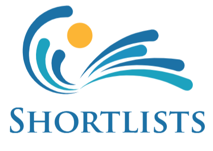

<!--
*** Thanks for checking out the Best-README-Template. If you have a suggestion
*** that would make this better, please fork the repo and create a pull request
*** or simply open an issue with the tag "enhancement".
*** Don't forget to give the project a star!
*** Thanks again! Now go create something AMAZING! :D
-->

<!-- PROJECT SHIELDS -->
<!--
*** I'm using markdown "reference style" links for readability.
*** Reference links are enclosed in brackets [ ] instead of parentheses ( ).
*** See the bottom of this document for the declaration of the reference variables
*** for contributors-url, forks-url, etc. This is an optional, concise syntax you may use.
*** https://www.markdownguide.org/basic-syntax/#reference-style-links
-->

[![Contributors][contributors-shield]][contributors-url]
[![Forks][forks-shield]][forks-url]
[![Stargazers][stars-shield]][stars-url]
[![Issues][issues-shield]][issues-url]
[![MIT License][license-shield]][license-url]
[![LinkedIn][linkedin-shield]][linkedin-url]

<!-- PROJECT LOGO -->
 

  

  <h3 align="center">Shortlists</h3>

  

   Responsive Mobile and Desktop Web Application for creating, sharing and ranking lists between friends.
     
    <a href="https://github.com/jaketycyn/Shortlists_Production"><strong>Explore the docs »</strong></a>
     
     
    <a href="https://shortlists-mobile-jaketycyn.vercel.app/">View Demo</a>
    ·
    <a href="https://github.com/jaketycyn/Shortlists_Production/issues">Report Bug</a>
    ·
    <a href="https://github.com/jaketycyn/Shortlists_Production/issues">Request Feature</a>
  

<!-- TABLE OF CONTENTS -->

  
Table of Contents

  <ol>
    <li>
      <a href="#about-the-project">About The Project</a>
      <a href="#about-the-coding-journey">About the Coding Journey</a>
    </li>
    <li>
      <a href="#getting-started">Getting Started</a>
      <ul>
        <li><a href="#account-creation">Account Creation</a></li>
        <li><a href="#creating-a-list">Creating a list</a></li>
        <li><a href="#adding-items">Adding Items</a></li>
      </ul>
    </li>
    <li><a href="#roadmap">Roadmap</a></li>
    <li><a href="#tech-stack">Tech Stack</a></li>
    <li><a href="#contact">Contact</a></li>
    <li><a href="#acknowledgments">Acknowledgments</a></li>
  </ol>

<!-- ABOUT THE PROJECT -->

## About The Project

[![Product Name Screen Shot][product-screenshot]](https://example.com)

Shortlists is an application that allows users to create an account, create lists, attach items to those lists, and share them with other users. The longterm goal is to expand into allowing users to rank or pose lists with multiple options to friends. From here people will be able to 'prompt' friends/family,coworkers,etc on various things - favorite Disney film, places they want to go, what they want to do on the weekend, etc. This basic premise of probing people for information can be utilized to by someone to make more informed decisions.

On the more passive side, seeing a friends 'Top 10 Books/Movies/TvShows this year' list could benefit someone into exploring and experience entertainment they didn't know existed.

The distant and far reaching plan is to expand this into a social media platform that allows users to better find people with similar interests, communicate on those interests, discover new interests and find people incredibly knowledgeable on said interests.

## About the Coding Journey

Shortlists started as a diy project to help me, as a self-taught developer, code in a more realistic environment. Taking the classic beginner project of making a todo list I sought out ways of expanding it into a fullstack application.

The first major step was finding a way to store data long-term. I did this both locally for a user with Redux (utilizing Redux-persist) & by creating accounts with a backend comprised of Node, express, and Postgresql. For a brief time I used MongoDB before realizing all future data would be relational and the best long term solution was to take the gigantic hurdle into relational database management.

The next major step was sharing lists between users. I discovered an interesting library called TRPC3 which allowed me to better control and communicate between my front and backend.

<!-- ROADMAP -->

## Roadmap

- [x] Account Creation and OAuth
- [x] Share between users
- [x] Find and Add other users to friends list
- [x] Redo Readme.md
- [x] Add back to top links
- [ ] Create Test/Guest Account setup
- [ ] Update Send List functionality to account for User's Friendlist
- [ ] Co-edited lists/items
- [ ] List Ranking features

## Tech Stack

**Client:** React, NextJs, TypeScript, Redux, TailwindCSS

**Server:** Node, Express, Postgresql, TRPC3, Prisma

<!-- CONTRIBUTING -->

<!-- LICENSE NO LICENSE FOR NOW-->

<!-- CONTACT -->

## Contact

Jake TyCyn Schmidt - jaketycyn@gmail.com

Project Link: [ShortLists](https://shortlists-mobile-jaketycyn.vercel.app/)

<!-- ACKNOWLEDGMENTS -->

## Acknowledgments

- [Malven's Flexbox Cheatsheet](https://flexbox.malven.co/)
- [Malven's Grid Cheatsheet](https://grid.malven.co/)
- [Img Shields](https://shields.io)
- [GitHub Pages](https://pages.github.com)
- [Font Awesome](https://fontawesome.com)
- [React Icons](https://react-icons.github.io/react-icons/search)

(<a href="#top">back to top</a>)

<!-- MARKDOWN LINKS & IMAGES -->
<!-- https://www.markdownguide.org/basic-syntax/#reference-style-links -->

[contributors-shield]: https://img.shields.io/github/contributors/othneildrew/Best-README-Template.svg?style=for-the-badge
[contributors-url]: https://github.com/othneildrew/Best-README-Template/graphs/contributors
[forks-shield]: https://img.shields.io/github/forks/othneildrew/Best-README-Template.svg?style=for-the-badge
[forks-url]: https://github.com/othneildrew/Best-README-Template/network/members
[stars-shield]: https://img.shields.io/github/stars/othneildrew/Best-README-Template.svg?style=for-the-badge
[stars-url]: https://github.com/othneildrew/Best-README-Template/stargazers
[issues-shield]: https://img.shields.io/github/issues/othneildrew/Best-README-Template.svg?style=for-the-badge
[issues-url]: https://github.com/othneildrew/Best-README-Template/issues
[license-shield]: https://img.shields.io/github/license/othneildrew/Best-README-Template.svg?style=for-the-badge
[license-url]: https://github.com/othneildrew/Best-README-Template/blob/master/LICENSE.txt
[linkedin-shield]: https://img.shields.io/badge/-LinkedIn-black.svg?style=for-the-badge&logo=linkedin&colorB=555
[linkedin-url]: https://linkedin.com/in/othneildrew
[product-screenshot]: images/screenshot.png
[next.js]: https://img.shields.io/badge/next.js-000000?style=for-the-badge&logo=nextdotjs&logoColor=white
[next-url]: https://nextjs.org/
[react.js]: https://img.shields.io/badge/React-20232A?style=for-the-badge&logo=react&logoColor=61DAFB
[react-url]: https://reactjs.org/
[javascript.js]: https://camo.githubusercontent.com/0dc176976add53c960306227f875bdeb8b1f77a5db6b9fc8c86e227fce652c31/68747470733a2f2f696d672e736869656c64732e696f2f62616467652f4a6176615363726970742532302d2532334637444631452e7376673f7374796c653d666f722d7468652d6261646765266c6f676f3d6a617661736372697074266c6f676f436f6c6f723d626c61636b
[javascript-url]: https://javascript.com/
